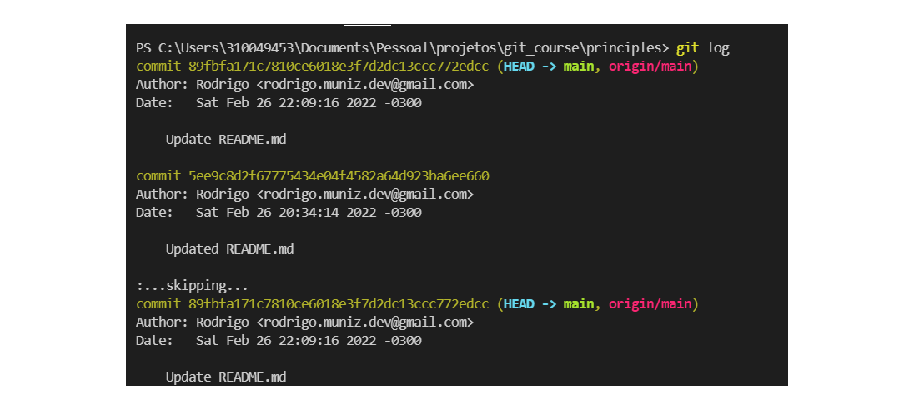
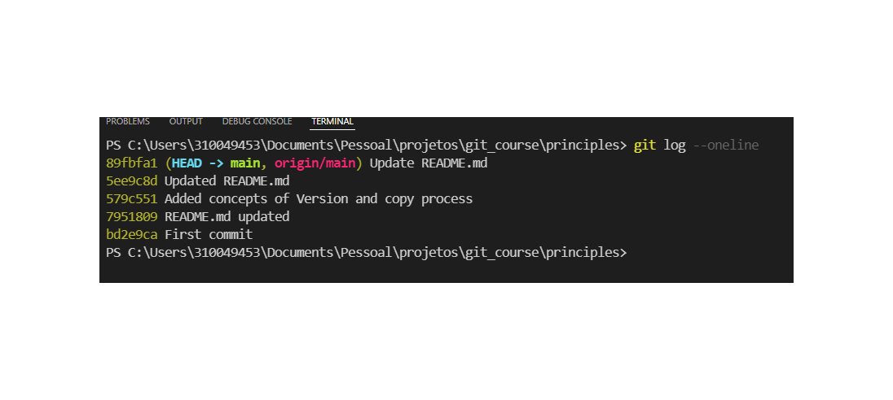
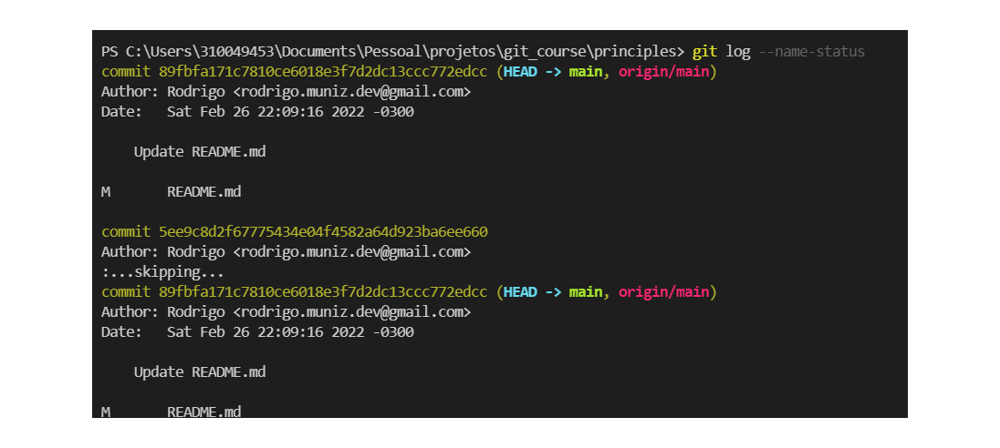
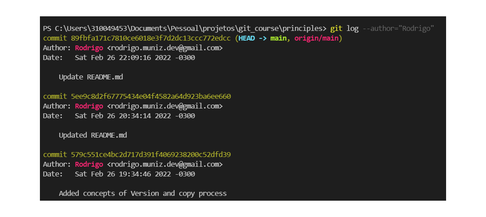
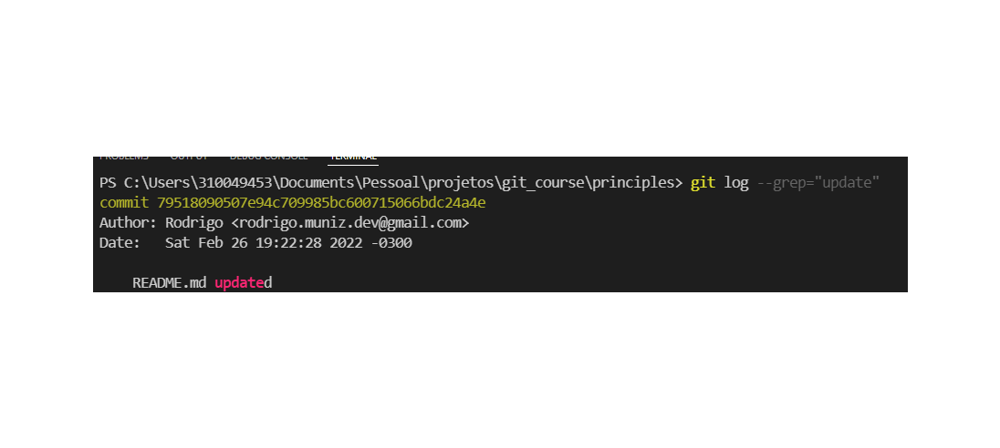
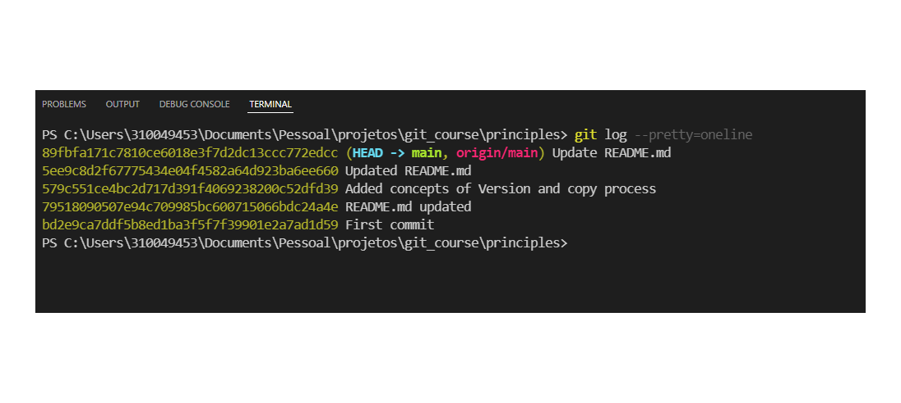
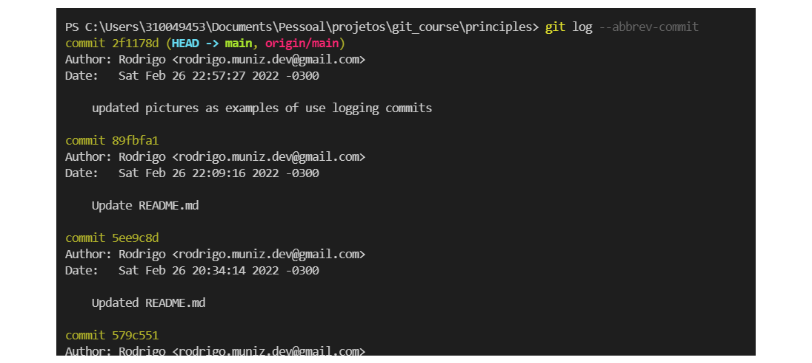
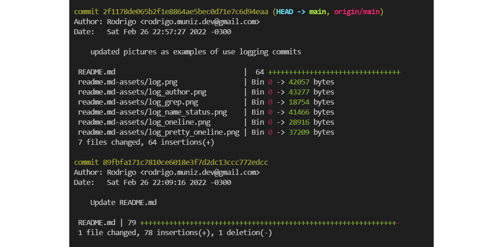
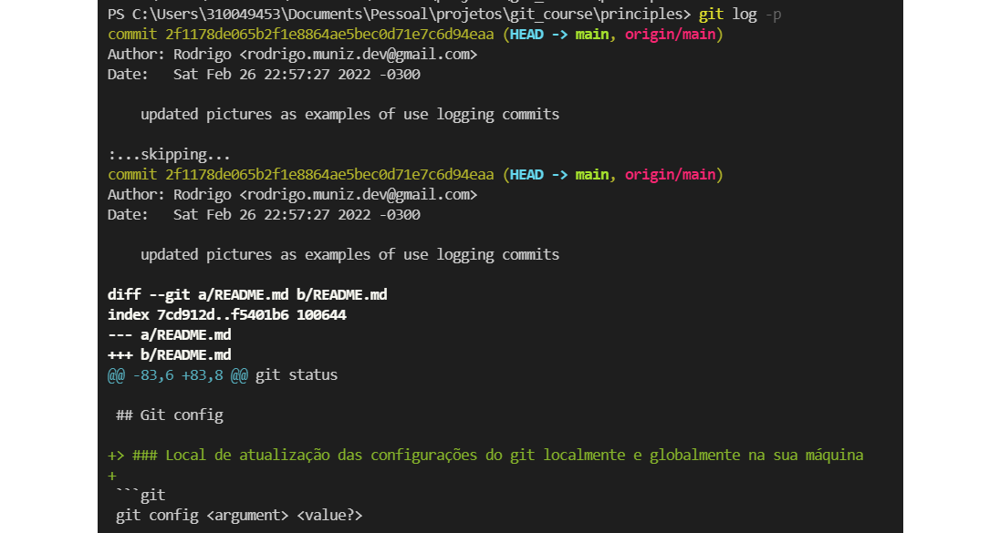
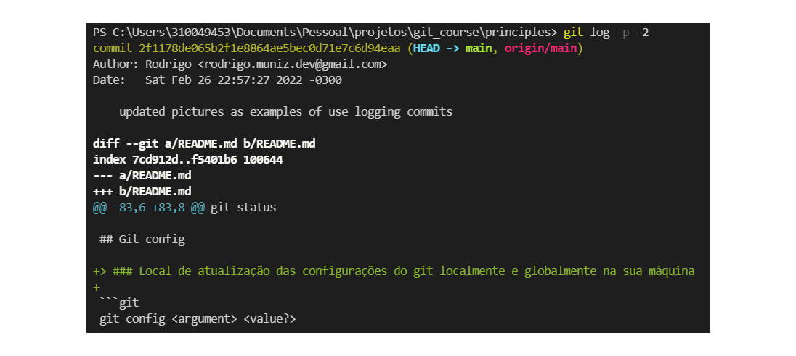

# Git

## Concepts

Git trata seus dados mais como um conjunto de imagens de um sistema de arquivos em miniatura.
Toda vez que você fizer um commit, ou salvar o estado de seu projeto no Git, ele basicamente tira uma foto de todos os seus arquivos e armazena uma referência para esse conjunto de arquivos. Para ser eficiente, se os arquivos não foram alterados, o Git não armazena o arquivo novamente, apenas um link para o arquivo idêntico anterior já armazenado. O Git trata seus dados mais como um fluxo do estado dos arquivos.


Armazenando dados como um estado do conjunto de arquivos do projeto ao longo do tempo.
Esta é uma diferença importante entre o Git e quase todos os outros VCSs. Isto faz o Git reconsiderar quase todos os aspectos de controle de versão que a maioria dos outros sistemas copiaram da geração anterior.

---

## Integrity

O mecanismo que o Git utiliza para esta soma de verificação é chamado um hash SHA-1. Esta é uma sequência de 40 caracteres composta de caracteres hexadecimais (0-9 e-f) e é calculada com base no conteúdo de uma estrutura de arquivo ou diretório no Git. Um hash SHA-1 é algo como o seguinte:

```
24b9da6552252987aa493b52f8696cd6d3b00373
```

#

## Git work tree


- ### Working directory

  > Diretório de trabalho atual

- ### Staging area

  > Cria uma "imagem" do arquivo a ser comitado. Nessa área o arquivo não pode ser modificado

- ### Git directory
  > árvore de diretórios do git. É criado um ponto no histórico do git.

---

## Work flow

O fluxo de trabalho básico Git é algo assim:

- Você modifica arquivos no seu diretório de trabalho.

- Você prepara os arquivos, adicionando imagens deles à sua área de preparo.

- Você faz commit, o que leva os arquivos como eles estão na área de preparo e armazena essa imagens de forma permanente para o diretório do Git.

---

## Git init

> ### Inicializa um repositório GIT no projeto

```git
git init
```

---

## Git version

> ### Versão do git instalado no sistema

```git
git --version
```

---

## Git status

> ### Verifica o status da árvore do git atual

```git
git status
```

---

## Git config

> ### Local de atualização das configurações do git localmente e globalmente na sua máquina

```git
git config <argument> <value?>

Exemplo de configuração:
$ git config --global user.name "Um nome qualquer"
$ git config --global user.email umapessoaaleatoria@email.com
```

---

## Git add

> ### Adiciona arquivos do diretório de trabalho atual a **_staging area_**

```git
git add  <file1> <file2> ... <filen>
```

> ### Adiciona a **_staging area_** todo tipo de alteração(add/rm).

```git
git add  --all
```

> ### Variação do git add --all

```git
git add -A
```

---

## Git commit

> ### Adiciona o(s) arquivo da **_staging area_** para o **_git directory_**. Configurações são necessárias

```git
git commit -m <"value">

Ex.:
git commit -m "Um commit aleatório"

```

> ### Abrirá um editor de texto configurado para inserir a mensagem de commit.

```git
git commit -a
```

> ### Adicionar e commitar com uma linha

```git
git commit -a -m <"value">
```

---

## git log

> ### Visualiza o histórico de commits. Existem variações deste comando.

```git
git log
```



> ### Apresenta os 7 primeiros dígitos do hashcode + a descrição.

```git
git log  --oneline
```



> ### Apresenta o histórico de maneira mais resumida e organizada. As letras representam:
>
> - A: Added
> - D: Deleted
> - M: Modified
> - U: Untracked

```git
git log --name-status
```



> ### Lista filtrando pelo autor.

```git
git log --author="nome do autor"
```



> ### Lista filtrando pela palavra / argumento passado.

```git
git log --grep="palavra"
```



> ### Semelhante ao --oneline, porém com todo o hashcode.

```git
git log --pretty=oneline
```



> ### Abrevia as mensagens dos logs.
>
> - Obs.: log --pretty=oneline --abbrev-commit == log --oneline

```git
git log --abbrev-commit
```



> ### Apresenta as estatísticas sobre os commits.

```git
git log --stat
```



> ### Apresenta as alterações realizdas em cada commit.S

```git
git log -p
```



> ### **_n_** == integer. Este valor representa a quantidade de commits a serem apresentandos.

```git
git log -p -n
```


